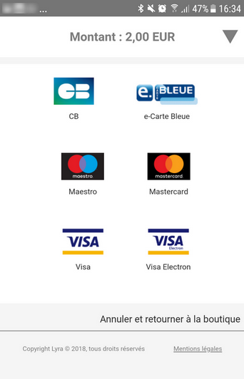

# Webview Payment integration example

## Summary

The aim of this repository is to explain how webview mobile payment integration can be done easily.


## Table of contents

* [How it works](#how_it_is_work)
* [Getting started](#getting_started)
* [Additional features](#features)
* [Technology](#technology)
* [Troubleshooting](#troubleshooting)
* [Copyright and license](#copyright)

<span id="how_it_is_work"></span>
## How it works

To be able to do some payments, two elements are required::
* A contract with your Payment service provider
* A mobile app with a webview mobile payment integration: this integration is explained with this repository.
* A merchant server that executes payments transactions with the payment servers: [merchant server demonstration](https://github.com/lyra/webview-payment-sparkjava-integration-sample)

<span id="getting_started"></span>
## Getting started

### Execute this sample

1. See merchant server repo, `https://github.com/lyra/webview-payment-sparkjava-integration-sample`. Follow steps of getting started chapter and run your server

2. Clone the repo, `git clone https://github.com/lyra/webview-payment-android-integration-sample.git`. 

3. Open the project under Android Studio

4. Edit the following field in `MainActivity.kt`
    - SERVER_URL: replace by your merchant server url

5. Run it and that's all! :)


### Integration in an existing app

1. See merchant server repo, `https://github.com/lyra/webview-payment-sparkjava-integration-sample`. Follow steps of getting started chapter and run your server

2. Copy-paste `com.lyranetwork.sampleandroidwebview.payment` package into your project

3. Add the following code  into your AndroidManifest file

    ```xml
    <uses-permission android:name="android.permission.INTERNET" />
    ```
    
    In application part, add the embedded payment activity:
    ```xml
    <activity
        android:name=".payment.PaymentActivity" />
    ```
    
	<p align="center">
	  
	</p>
    
4. In your activity where you want execute a payment, add an inheritance of this activity to `AbstractPaymentActivity`.

	Example:
	```kotlin
	class MainActivity: AbstractPaymentActivity()
	```

5. Execute `PaymentProvider.execute(payload: PaymentData, serverUrl: String, activity: Activity)` method by providing the following fields:
	- serverUrl: replace by your merchant server url
    - payload: PaymentData that represents your payment data:
		- mode: *mandatory*, TEST or PRODUCTION (your targeted environment)
		- orderId: *optional*, your order identifier
		- amount: *mandatory*, the related amount
		- email: *optional*, email
		- cardType: *optional*, can be CB, VISA, MASTERCARD, so on. If no provided, any card type will be proposed
		- currency: *mandatory*, currency code, https://en.wikipedia.org/wiki/ISO_4217
	
	Example:
	```kotlin
	val payload = PaymentData()
    payload.setOrderId(orderText.text.toString())
    payload.setAmount(amountText.text.toString())
    payload.setEmail(emailText.text.toString())
    payload.setMode("TEST")
	payload.setCurrency("978")
		
	PaymentProvider.execute(payload, "http://my-merchant-server", this)
	```
	
6. Implement `handlePaymentResult(result: PaymentResult)` in order to handle the payment result.

	Example:
	```kotlin
	override fun handlePaymentResult(result: PaymentResult) {
        if (result.isSuccess()) {
            Toast.makeText(this, "Payment successful" , Toast.LENGTH_LONG).show()
        } else {
            Toast.makeText(this, "Payment failed. errorCode = " + result.getErrorCode() + " and cause = " + result.getCause() , Toast.LENGTH_LONG).show()
        }
    }
	```

7. Run it and that's all! :)

<span id="features"></span>
## Additional features

Also, two additional features can be used:
* Credit card scanning by mobile camera

In the branch below, you can see a demonstration of credit card scanning by mobile camera based on [Card.io SDK](https://www.card.io/)

https://github.com/lyra/webview-payment-android-integration-sample/tree/card_scanning/

* Credit card scanning by NFC

In the branch below, you can see a demonstration of credit card scanning by NFC based on [EMV NFC Card](https://github.com/devnied/EMV-NFC-Paycard-Enrollment)

https://github.com/lyra/webview-payment-android-integration-sample/tree/card_scanning_by_nfc/


**Our company does not guarantee and is not responsible for the quality of the external libraries.**

**Moreover, be aware that the use of these libraries is not [PCI-DSS](https://www.pcisecuritystandards.org/document_library?category=pcidss&document=pci_dss) compliant.**

<span id="technology"></span>	
## Technology

Developped in Android Studio Chipmunk | 2021.2.1, written in Kotlin 1.7.0, this sample app requires Android API 19 or superior.

<span id="troubleshooting"></span>	
## Troubleshooting

The following errors can occurred:

| Error  | Code | Cause |
| ------------- | ------------- | ------------- |
| UNKNOWN_ERROR  | 1 | An unknown error has occurred. This error can occur when the url of merchant server is incorrect. Check that your url is syntactically correct. |
| TIMEOUT_ERROR  | 2 | A timeout error has occurred. This error can occur when your mobile is not able to communicate with your merchant server. Check that your server is up and is reachable. |
| NO_CONNECTION_ERROR  | 3 | A no connection error has occurred. This error can occur when your mobile is not connected to Internet (by Wifi or by mobile network). Check your mobile connection | 
| SERVER_ERROR  | 4 | A server error has occurred. This error can occur when your merchant server returns an invalid data. Check that your payment data sent are correct. |
| PAYMENT_CANCELLED_ERROR  | 5 | A payment cancelled error has occurred. This error can occur when user cancels he payment process. |
| PAYMENT_REFUSED_ERROR  | 6 | A payment refused error has occurred. This error can occur when payment is refused. Check the credit card used. |

<span id="copyright"></span>
## Copyright and license
	The MIT License

	Permission is hereby granted, free of charge, to any person obtaining a copy
	of this software and associated documentation files (the "Software"), to deal
	in the Software without restriction, including without limitation the rights
	to use, copy, modify, merge, publish, distribute, sublicense, and/or sell
	copies of the Software, and to permit persons to whom the Software is
	furnished to do so, subject to the following conditions:

	The above copyright notice and this permission notice shall be included in
	all copies or substantial portions of the Software.

	THE SOFTWARE IS PROVIDED "AS IS", WITHOUT WARRANTY OF ANY KIND, EXPRESS OR
	IMPLIED, INCLUDING BUT NOT LIMITED TO THE WARRANTIES OF MERCHANTABILITY,
	FITNESS FOR A PARTICULAR PURPOSE AND NONINFRINGEMENT. IN NO EVENT SHALL THE
	AUTHORS OR COPYRIGHT HOLDERS BE LIABLE FOR ANY CLAIM, DAMAGES OR OTHER
	LIABILITY, WHETHER IN AN ACTION OF CONTRACT, TORT OR OTHERWISE, ARISING FROM,
	OUT OF OR IN CONNECTION WITH THE SOFTWARE OR THE USE OR OTHER DEALINGS IN
	THE SOFTWARE.